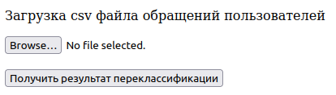

# fincubator_hacksai

## Структура проекта

```
├─ configs/
├─ data/
├─ models/
├─ objects/
│  └─ encoders/
├─ results/
└─ src
   ├─ app
   │  ├─ server.py
   │  └─ templates
   │     └─ index.html
   ├─ notebooks
   │  ├─ baseline.ipynb
   │  └─ eda.ipynb
   └─ utils
      ├─ model.py
      ├─ predict.py
      └─ transforms.py
```
- ```src/app/``` - микросервис
- ```src/notebooks``` - .ipynb ноутбуки с экспериментами
- ```src/utils/```:
    - ```model.py``` - модуль для обучения модели
    - ```predict.py``` - модуль для инференса
    - ```transforms.py``` - вспомогательные трансформации данных


## Установка библиотек
```
python3 -m pip install -r requirements.txt
```

## Подзадача 1

### Локальный деплой

#### Запуск сервиса на локальном хосте

Реализован REST-API сервис на ```flask```, запуск сервиса:
```
python3 -m src.app.server
```
Сервис доступен по адресу http://127.0.0.1:5000

#### Интерфейс сервиса для определения типа переклассификации

**UI** интерфейс позволяет пользователю загружать ```.csv``` файл для определения типа переклассификации:



После загрузки файла и клика "Получить результат переклассификации" начинает скачиваться файл с полями ```"id", "Тип переклассификации", "Тип финального запроса"```. Пример ```.csv``` файла находится в папке ```data/csv/test.csv```

#### API

Сервису также можно отправить ```.json``` файл с информацией о запросе:

```
curl localhost:5000/predict_json -H 'Content-Type: application/json' -d @/path/to/filename.json
```

В ответ сервис отправляет ```.json``` с результатами определения типа переклассификации. Пример ```.json``` файла находится в папке ```data/json/test.json```:
```
{
    "id":14803,
    "Содержание":"Заявка на предоставление и отзыв прав доступа к ресурсам",
    "Сервис":"Сервис41",
    "Приоритет":"3-Низкий",
    "Статус":"Закрыт",
    "Функциональная группа":"ФГ13",
    "Крайний срок":"2018-02-22 07:51",
    "Дата обращения":"2018-02-16 13:11",
    "Тип обращения на момент подачи":"Запрос",
    "Тип обращения итоговый":null,
    "Решение             ":"Работы по обращению выполнены",
    "Тип переклассификации":null,
    "Дата восстановления":"2018-02-18 04:32",
    "Дата закрытия обращения":"2018-02-25 07:56",
    "Критичность":"4-Нет",
    "Влияние":"4-Нет влияния",
    "Система":"Система43",
    "Место":"Место38"
}
```

### Автономная работа

Получение результата возможно непосредственно с использование командной строки:

```
python3 -m src.utils.predict /path/to/filename.<csv|json>
```

Результат сохраняется в папку ```results/<csv|json>/filename.<csv|json>```